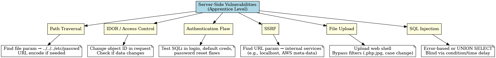

# Server-Side Vulnerabilities

Favorite: No
Status: Inbox
Created: August 9, 2025
Edited: August 9, 2025 4:50 PM
Archive: No
Pin: No

### **1. Path Traversal**

**Concept:** Manipulate file path parameters to access files outside intended directory.

**Lab Approach:**

- Identify file parameter (e.g., `?filename=report.pdf`).
- Replace value with `../../../etc/passwd` or deeper based on directory depth.
- Use **URL encoding** (`..%2f..%2f..%2fetc/passwd`) if filtering.
- Success = reading sensitive file.

---

### **2. IDOR (Access Control)**

**Concept:** App uses direct object references without verifying ownership.

**Lab Approach:**

- Log in as a normal user, capture request for sensitive resource (e.g., `userId=123`).
- Change ID to another valid one (e.g., `userId=124`).
- Use **Burp Repeater** to test multiple values.
- If data from another account appears → vulnerability confirmed.

---

### **3. Authentication Bypass / Logic Flaw**

**Concept:** Flawed login logic or poor credential handling.

**Lab Approach:**

- Test bypasses: `' OR 1=1--`, default creds, case-insensitive checks, duplicate params.
- Check password reset tokens → can you reset without email?
- Look for alternate login endpoints.

---

### **4. SSRF**

**Concept:** Make server send requests to internal/external URLs.

**Lab Approach:**

- Find parameter that takes a URL (e.g., `?stockApi=http://example.com`).
- Change to internal resource: `http://localhost/admin` or `http://169.254.169.254/latest/meta-data/` (AWS creds).
- Encode if needed (`http%3A%2F%2Flocalhost`).
- Goal: retrieve restricted internal content.

---

### **5. File Upload**

**Concept:** Uploading malicious files due to poor validation.

**Lab Approach:**

- Upload `.php` or `.jsp` shell with simple payload (`<?php system($_GET['cmd']); ?>`).
- If extension blocked, try double extension (`shell.php.jpg`) or case change (`.pHp`).
- Access uploaded file directly via known upload path.
- Run commands to prove RCE.

---

### **6. SQL Injection**

**Concept:** Inject SQL into queries to manipulate database.

**Lab Approach:**

- Identify parameter in GET/POST interacting with DB.
- Test with `'` → check for SQL error.
- Use UNION-based injection: `' UNION SELECT NULL,NULL--` then adjust column count.
- Extract data: `' UNION SELECT username,password FROM users--`.
- If blind: use conditional queries (`AND 'a'='a'`) or time delays.

---

## 📌 **Key Fast Patterns**

| Vuln | Quick Payload/Trick |
| --- | --- |
| Path Traversal | `../../../etc/passwd` → URL encode if filtered |
| IDOR | Change numeric/string IDs in request |
| Auth Bypass | `' OR '1'='1--`, duplicate params, logic flaws |
| SSRF | Internal URLs: `http://localhost`, cloud metadata |
| File Upload | Web shell + bypass extension filters |
| SQLi | `' UNION SELECT ... --`, blind via time-based payloads |

